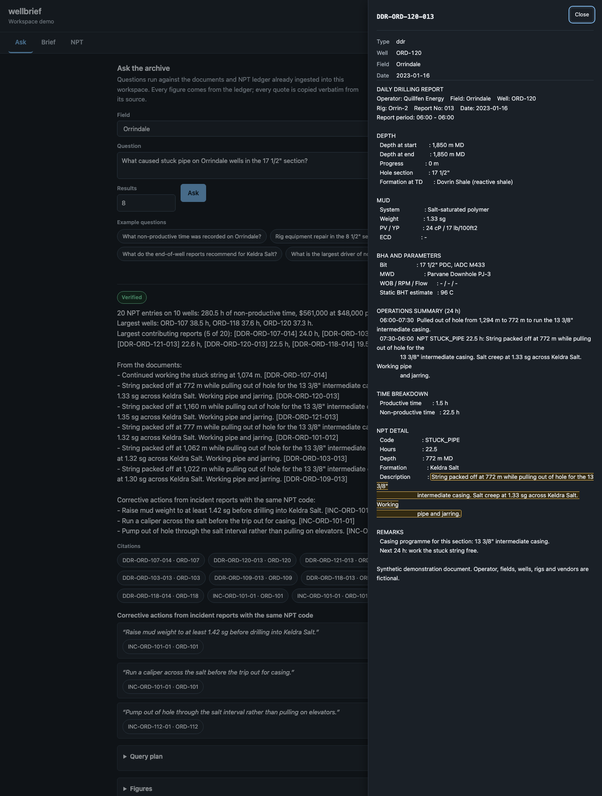
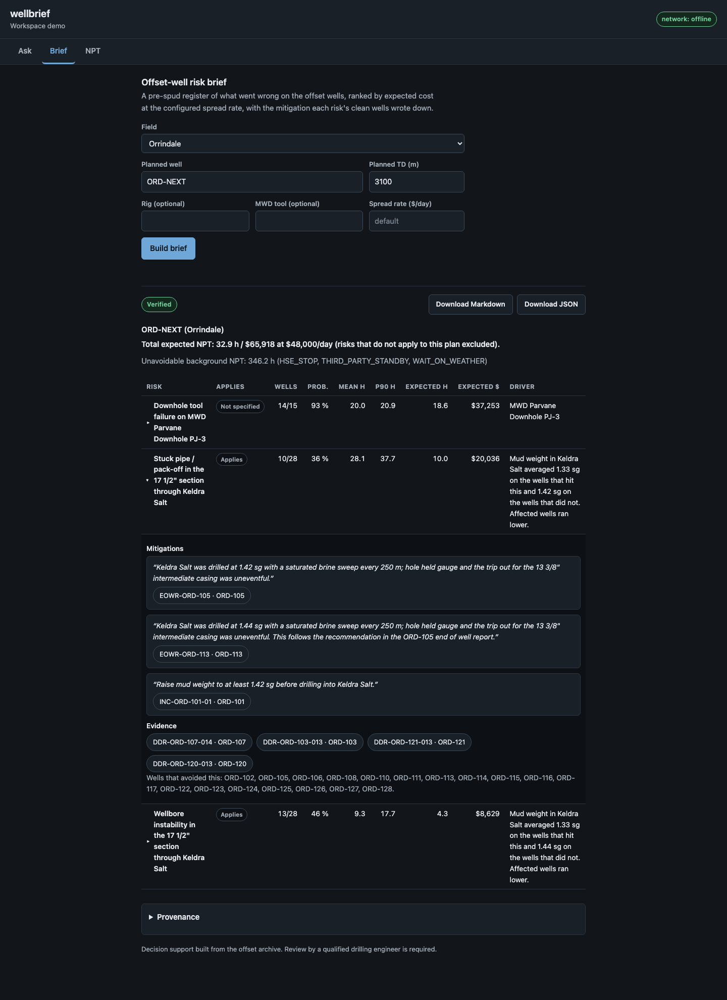
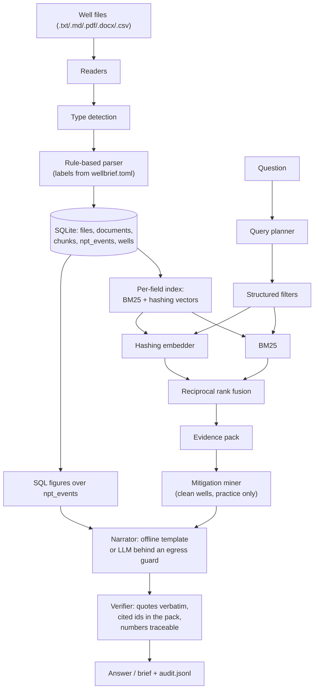

# wellbrief

Offline retrieval-augmented answers and pre-spud offset-well risk briefs over a field's own
drilling reports, with no network access required at any point.

[](https://github.com/B0yko/wellbrief/actions/workflows/ci.yml)
[](LICENSE)
[](pyproject.toml)

## Screenshots





## Why

Reviewing a field's daily drilling reports, end-of-well reports and incident reports before
planning the next well is manual, slow, and easy to get wrong: the answer someone remembers is
not always the one the reports actually say, and the non-productive time (NPT) a recurring
problem has cost is rarely added up. `wellbrief` ingests that archive, answers questions with
citations checked word for word against the source, and builds a pre-spud offset-well risk brief
that ranks what went wrong on the offset wells, prices it at a spread rate, and quotes a
mitigation verbatim from a well that avoided the problem. The reports it reads describe
operations; some sites cannot put that data on a network the tool itself does not control, so
every command runs the same way with the network disabled at the operating system or container
level.

## Quickstart

Try it on a generated demo field (under 5 minutes, no data of your own required):

```bash
uvx --from git+https://github.com/B0yko/wellbrief wellbrief demo
```

or with Docker:

```bash
docker run --rm -p 127.0.0.1:8765:8765 ghcr.io/b0yko/wellbrief:0.1.0
```

Either command generates a small synthetic field, ingests it, builds the retrieval indexes and
opens a browser on the local UI. Both tabs work immediately: ask a question, or build a risk
brief for a planned well.

On your own reports:

```bash
wellbrief ingest /path/to/well-files --field "My Field"
wellbrief ask "What caused stuck pipe in the 17 1/2 inch section on My Field?"
wellbrief brief --field "My Field" --well MF-NEXT --td 3100
```

`ingest` reads `.txt`, `.md`, `.pdf`, `.docx` and `.csv` files; a folder with a different report
template needs only a `wellbrief.toml` next to it (see [Configuration reference](#configuration-reference)
and `examples/alt-template/`), not a code change.

## How it works



Structured filters (field, well, hole section, formation, NPT code, depth, document type) run
before retrieval, not after: they narrow the candidate set before BM25 and the hashing embedder
run, so a question that names a well or a section only ever ranks documents that could actually
answer it. The two rankings are fused with reciprocal rank fusion (RRF) and the best chunk of
each document is kept before the top-k cut. Numeric figures never come from the language model:
they are computed with SQL over the NPT ledger, and the narrator only phrases them. Mitigations
are mined separately: a sentence is only shown as a mitigation when it is a practice sentence
(not a description of the failure itself) from a well that did not have the problem, or a
corrective action from an incident report with the same NPT code. Whatever narrator produced the
text, a verifier checks every cited document id against the evidence pack, every number in the
text against the pack's quotes and computed figures, and every well or field name against the
same universe, before the answer is shown; a check that fails falls back to the deterministic
offline narrator with a visible banner, never a silently wrong answer.

## Offline by default

Every command works with no network access, and the CLI installs a process-level guard at
startup that blocks any other outbound socket connection or DNS lookup and counts it
(`netguard.py`): loopback addresses, Unix sockets, and — only while the `llm` narrator is
enabled — the one configured LLM host are allowed, everything else raises before a packet is
sent. `wellbrief status` and every `eval`/`selfcheck` run report the count as "outbound
connection attempts: N" and the network mode (`offline`, `local-llm` for a loopback LLM host, or
`remote-llm`).

The `llm` narrator talks to any OpenAI-compatible `/chat/completions` server — `mlx_lm.server`
or `llama-server` on a loopback address, or a hosted router such as OpenRouter — configured
entirely through environment variables (`WELLBRIEF_LLM_BASE_URL`, `WELLBRIEF_LLM_MODEL`,
`WELLBRIEF_LLM_API_KEY`). A non-loopback host is refused unless `WELLBRIEF_ALLOW_REMOTE=1` is
set, decided on the URL text alone with no DNS lookup (a lookup is itself outbound traffic).
Every request, sent or refused, is appended to the workspace's `egress.jsonl` with host, bytes,
document ids included, model, tokens, cost and latency; a cost ledger estimates the worst case
before every call and refuses it if the recorded spend plus that estimate would exceed
`WELLBRIEF_BUDGET_USD`. Reasoning output from Qwen3-style models is both stripped from the
returned text and switched off at the source with `chat_template_kwargs:
{"enable_thinking": false}`, which both `mlx_lm.server` and `llama-server` read from the request
body. `wellbrief selfcheck` runs the full offline pipeline in a disposable workspace, then
connects once to a documented test address as a positive control and confirms the guard blocked
it — the command a network-disabled proof runs against (see
[Offline proof](#9-offline-proof) below and [docs/airgapped-install.md](docs/airgapped-install.md)
for a verified wheelhouse and saved-image install with no network access at all).

## Configuration reference

Precedence, highest first: CLI flags, environment variables, `ingest --config PATH` (or, absent
that, the ingested folder's own `wellbrief.toml`), the workspace's own `wellbrief.toml`, then the
built-in defaults below. The parse/detection/taxonomy/CSV tables only matter while ingesting, so
for them the CLI layer only ever provides `--config`.

### Environment variables

| Variable | Purpose | Default |
| --- | --- | --- |
| `WELLBRIEF_HOME` | workspace root directory | `~/.wellbrief` |
| `WELLBRIEF_WORKSPACE` | workspace name inside `WELLBRIEF_HOME` | `default` |
| `WELLBRIEF_NARRATOR` | `offline` or `llm` | `offline` |
| `WELLBRIEF_LLM_BASE_URL` | OpenAI-compatible server base URL | none (the `llm` narrator refuses to build without it) |
| `WELLBRIEF_LLM_MODEL` | model name sent in every request | none (same) |
| `WELLBRIEF_LLM_API_KEY` | bearer token, when the server needs one | none |
| `WELLBRIEF_ALLOW_REMOTE` | `1` allows a non-loopback `WELLBRIEF_LLM_BASE_URL` | unset (remote refused) |
| `WELLBRIEF_LLM_PRICE_IN_PER_MTOK` | USD per million input tokens, used when the provider reports no cost | none |
| `WELLBRIEF_LLM_PRICE_OUT_PER_MTOK` | USD per million output tokens, same fallback | none |
| `WELLBRIEF_BUDGET_USD` | cumulative spend cap per workspace before a call is refused | `10` |
| `WELLBRIEF_CA_BUNDLE` | path to a PEM file, replacing the default TLS trust store | none (system trust store) |
| `WELLBRIEF_SPREAD_RATE_USD_PER_DAY` | all-in day rate used for every cost figure | `48000` (illustrative) |

### Global flags

`--workspace NAME`, `--narrator offline|llm`, `--spread-rate USD` — each overrides the matching
environment variable for one invocation; see `wellbrief --help` and each subcommand's `--help`
for the full flag surface (`ingest`, `index`, `status`, `ask`, `brief`, `npt`, `patterns`,
`corpus generate`, `eval`, `bench`, `selfcheck`, `serve`, `demo`).

### `wellbrief.toml` tables

`[risk]` (thresholds a pattern must clear before it is shown in a brief; see
[docs/adr/0011-risk-statistics.md](docs/adr/0011-risk-statistics.md) for the formulas):

| Key | Default |
| --- | --- |
| `min_lift` | `2.0` |
| `min_wells` | `2` |
| `min_support` | `0.3` |
| `max_risks` | `8` |
| `equipment_min_ratio` | `2.0` |
| `equipment_min_rate` | `0.4` |
| `equipment_min_wells` | `3` |

`[retrieval]`:

| Key | Default |
| --- | --- |
| `top_k` | `8` |
| `rrf_k` | `60` |
| `k1` | `1.5` |
| `b` | `0.75` |

`[parse.ddr.labels]` — the label text the daily-report parser looks for, one entry per field:

| Key | Default label |
| --- | --- |
| `depth_at_start` | `Depth at start` |
| `depth_at_end` | `Depth at end` |
| `progress` | `Progress` |
| `hole_section` | `Hole section` |
| `formation_at_td` | `Formation at TD` |
| `weight` | `Weight` |
| `ecd` | `ECD` |
| `bht` | `Static BHT estimate` |
| `mwd` | `MWD` |
| `productive_time` | `Productive time` |
| `non_productive_time` | `Non-productive time` |
| `npt_code` | `Code` |
| `npt_hours` | `Hours` |
| `npt_depth` | `Depth` |
| `npt_formation` | `Formation` |
| `npt_description` | `Description` |

`[parse.eowr.sections]`: `npt_by_code` = `NPT BREAKDOWN BY CODE`, `lessons` = `LESSONS LEARNED`,
`recommendations` = `RECOMMENDATIONS FOR FUTURE WELLS` (each heading also matches an optional
leading `"<number>. "`, so a site need not renumber its own template).

`[parse.incident.sections]`: `root_cause` = `ROOT CAUSE`, `corrective_actions` =
`CORRECTIVE ACTIONS`.

`[detect.headings]` — the first-lines-of-file heading that names a document's type (a filename
prefix of `DDR-`/`EOWR-`/`INC-` is the fallback when a heading is missing or unrecognised, and is
not configurable): `ddr` = `DAILY DRILLING REPORT`, `eowr` = `END OF WELL REPORT`, `incident` =
`WELL OPERATIONS INCIDENT REPORT`.

`[taxonomy.aliases]` — a site's own NPT code spelling mapped to the built-in taxonomy (below);
empty by default, so an unmapped code becomes `OTHER`. Example: `SP = "STUCK_PIPE"`.

`[taxonomy.keywords]` — the mitigation miner's relevance words per code; a site's own list
*replaces* a code's default list rather than adding to it. Defaults:

| Code | Default keywords |
| --- | --- |
| `STUCK_PIPE` | pack-off, mud weight, sg, salt, trip |
| `LOST_CIRCULATION` | losses, lcm, flow rate, pill |
| `WELLBORE_INSTABILITY` | salt, sg, mud weight, overpull, tight hole |
| `HOLE_CLEANING` | cuttings, sweep, hole cleaning, reaming, annular velocity |
| `FISHING` | fish, jar, bha |
| `DOWNHOLE_TOOL_FAILURE` | mwd, temperature rating, temperature |
| `RIG_REPAIR` | mud pump, fluid end |
| `BOP_TEST_FAILURE` | bop, preventer, pressure test |
| `CEMENT_ISSUE` | cement |
| `WAIT_ON_MATERIALS` | barite, materials, logistics |
| `WAIT_ON_WEATHER` | weather, forecast |
| `THIRD_PARTY_STANDBY` | standby, third party, third-party |
| `HSE_STOP` | hse, stop work, lifting, safety |

`[csv]` `date_format` (a `time.strptime` pattern; when unset, a date must already be ISO
`YYYY-MM-DD`, optionally with a time) and `[csv.columns]` — a logical ledger column (`well`,
`date`, `code`, `hours`, `field`, `depth`, `section`, `formation`, `rig`, `description`) mapped to
the header your CSV actually uses; empty by default, so an unmapped column is looked up under its
own name. See `examples/npt-ledger.csv` and `examples/npt-ledger.toml` for a ledger with a `;`
delimiter, `day.month.year` dates and renamed headers, and `examples/alt-template/` for a full
report-template remap. Every key above is validated: an unknown table, key or shape is a clear
`SettingsError` naming the file and the offending key, never a silently ignored typo.

### NPT taxonomy

A simplified taxonomy modelled on common industry practice, not an official code list. Codes
marked not avoidable (weather, third-party standby, HSE stops) are summed into one background
line in a brief instead of becoming risks.

| Code | Label | Avoidable | Family |
| --- | --- | --- | --- |
| `STUCK_PIPE` | Stuck pipe / pack-off | yes | hole |
| `LOST_CIRCULATION` | Lost circulation | yes | hole |
| `WELLBORE_INSTABILITY` | Wellbore instability | yes | hole |
| `HOLE_CLEANING` | Hole cleaning / reaming | yes | hole |
| `FISHING` | Fishing | yes | hole |
| `DOWNHOLE_TOOL_FAILURE` | Downhole tool failure | yes | equipment |
| `RIG_REPAIR` | Rig equipment repair | yes | equipment |
| `BOP_TEST_FAILURE` | BOP test failure | yes | equipment |
| `CEMENT_ISSUE` | Cementing problem | yes | well_construction |
| `WAIT_ON_MATERIALS` | Waiting on materials | yes | logistics |
| `WAIT_ON_WEATHER` | Waiting on weather | no | external |
| `THIRD_PARTY_STANDBY` | Third party standby | no | external |
| `HSE_STOP` | HSE stop work | no | external |

## Results and benchmarks

Every number below comes from a committed `results/v0.1.0/*.json` file or from re-running its
command on this machine today (2026-09-27, Apple M5, 24 GB RAM, macOS 26.6.2, Python 3.12.14; the
JSON files carry the exact git SHA and a `dirty: false` flag). All figures use the default
synthetic corpus (seed `20260731`, 2 fields, 42 offset wells): re-running `wellbrief corpus
generate` and `wellbrief ingest`/`wellbrief eval` with the same seed reproduces every one of
them. `evals/cases/*.toml` holds every case in the open, reviewable with `tomllib`; gold answers
come from the generator's own `_truth.json` loaded into a separate, in-memory database that the
product's own code never touches, so a case cannot pass by asking the product to grade itself.

#### 1. Original harness (17 cases, ported from the prototype)

| Point | Result |
| --- | --- |
| Prototype import commit (tag `prototype-import`, `33392f8`) | 9/17 — every retrieval case fails |
| Wiring fix (`a850d7e`) | 17/17 |
| Current (`cd843fa`) | 17/17, 312/312 citations verbatim and resolving (100%) |

Reproduce: `git checkout prototype-import`, `uv sync --python 3.12`, then `wellbrief build` and
`wellbrief eval` in a scratch `WELLBRIEF_HOME`; current: `wellbrief eval --suite original`.

At the import commit, every one of the 8 retrieval cases failed with "cited document was not in
the evidence pack", even though retrieval itself found the right documents: the offline narrator
cites the end-of-well reports its mitigations are quoted from, but the evidence pack only held
the retrieval hits. `a850d7e` put the up-to-5 daily reports behind every computed figure and the
end-of-well report behind every mitigation into the pack as well, each with its own verbatim
quote, and made an empty-retrieval answer abstain with no figures or citations instead of still
attaching ledger figures. Nothing in the corpus or the cases changed between the two runs; the
9 → 17 gain is the wiring fix alone.

#### 2. Extended suite (52 cases across 9 categories)

| Category | First run | Final |
| --- | --- | --- |
| retrieval-precision (19) | 16/19, mean P@8 0.816, MRR 0.947 | 19/19, mean P@8 1.000, MRR 1.000 |
| arithmetic (9) | 9/9 | 9/9 |
| abstention (6) | 0/6 | 6/6 |
| brief-recall (4) | 3/4 | 4/4 |
| brief-driver (3) | 2/3 | 3/3 |
| mitigation-precision (2) | 0/2 | 2/2 |
| mitigation-recall (4) | 3/4 | 4/4 |
| parser-fidelity (2) | 2/2 | 2/2 |
| format-parity (3) | 0/3 | 3/3 |
| **total** | **35/52** | **52/52** |

Reproduce: `wellbrief eval --suite extended --out results/v0.1.0/extended-first-run.json` (first
run, committed) and `wellbrief eval --suite all --out results/v0.1.0/final-default-seed.json`
(current). The cases were written, and their first run recorded, before the fixes they measure;
no case has been removed or loosened since (`evals/CHANGES.md` logs every change to a case file
and currently has none to report). Abstention started at 0/6 because the answer for a
non-existent well or an empty code/section combination still returned citations from a
partial-filter match instead of the exact no-match sentence; the query planner rewrite fixed
that together with the retrieval-precision misses. Mitigation-precision and format-parity started
at 0 because mitigation quoting (the miner rewrite) and PDF/DOCX/CSV generation did not exist yet
at the first run.

#### 3. Robustness across seeds

Thresholds (`docs/adr/0011-risk-statistics.md`) were chosen on the default seed alone and frozen
before seeds `7` and `42` were run for the first time; nothing changed after seeing them.

| Seed | Original | Extended (mean P@8) | Brief precision |
| --- | --- | --- | --- |
| `20260731` | 17/17 | 52/52 (1.000) | 3/3 |
| `7` | 16/17 | 52/52 (0.993) | 3/3 |
| `42` | 17/17 | 52/52 (0.987) | 3/3 |

Reproduce: `wellbrief eval --suite original,extended,brief-precision --seeds 7,42 --out
results/v0.1.0/robustness-seeds.json`. Seed `7`'s one failure (`discovery-orrindale`) is a
disclosed, unmodified miss: on that random corpus, wellbore instability narrowly edges out stuck
pipe for the most NPT hours in the Keldra Salt interval, so the case's "top pattern" expectation
does not hold on that seed. It is reported as a failure, not patched.

#### 4. Retrieval ablation

19 retrieval-precision cases, four search modes:

| Mode | Mean P@8 | Mean MRR@8 |
| --- | --- | --- |
| BM25 only | 0.434 | 0.747 |
| Hashing only | 0.421 | 0.649 |
| Hybrid RRF, no planner filters | 0.447 | 0.711 |
| Hybrid + planner filters (product default) | 1.000 | 1.000 |

Reproduce: `wellbrief eval --ablation --out results/v0.1.0/ablation.json`. The hashing embedder
hashes words and character 3/4-grams into a signed 512-dimension vector: it captures fuzzy
lexical similarity (a misspelled or reordered word still hits), not meaning, and neither ranker
alone gets close to the product's actual precision — the planner's structured filters, applied
before either ranker runs, are what makes retrieval reliable.

#### 5. Brief precision and classifier accuracy

Share of a field's listed risks whose ledger key matches one of the four planted patterns
(target ≥ 0.75, filtered):

| Field | First run | Final (filtered) | Final (unfiltered, informational) |
| --- | --- | --- | --- |
| Orrindale | 4/8 (0.50) | 3/3 (1.00) | 3/6 (0.50) |
| Vessra South | 2/8 (0.25) | 3/4 (0.75) | 3/7 (0.43) |

Reproduce: `wellbrief eval --suite brief-precision --out results/v0.1.0/brief-precision-first-run.json`
(first run), `wellbrief eval --suite all --out results/v0.1.0/final-default-seed.json` (final,
filtered), `wellbrief eval --suite brief-precision --no-risk-filters` (unfiltered — reported, not
gated). The risk filters (minimum lift, minimum affected-well support, the unavoidable-code
exclusion) roughly double precision on both fields by cutting background noise codes (cementing,
materials, weather) that clear a much looser bar but are not one of the four planted patterns.

For comparison, the tool this project started from listed 8 risks for the same field's original
corpus, of which about 5 were the planted patterns; at the commit that only renamed the corpus's
fictional identifiers (before any of this project's own fixes), the same command lists 4 of 8
planted (cementing, waiting on materials, waiting on weather and rig-equipment-repair noise fill
the other four): `git checkout prototype-import && wellbrief build && wellbrief risk --field
Orrindale --well ORD-NEXT --td 3100`.

Classifier accuracy (the practice/failure/neutral sentence classifier the mitigation miner uses,
against every candidate sentence's truth label): **357/357 (100%)**, practice precision 100%
(targets 90% / 95%). Its phrase lists were written against this synthetic corpus's own 81 distinct
sentence templates, so this number shows template coverage, not accuracy on a real field report's
prose — see [Limitations](#limitations).

#### 6. Citation verification and verifier catch rate

Across every eval answer and brief on the default seed: **987/987 citations verbatim and
resolving (100%)** (original 312/312, extended 630/630, brief-precision 45/45). That figure is
true by construction for the offline narrator, since it only ever writes what the evidence pack
already contains, so the more informative number is the verifier's catch rate on injected faults:
5 cases × 4 fault kinds (a changed character inside a quote, a document id outside the pack, a
number that traces to nothing, a well name from another field) — **20/20 caught (100%)**.
Reproduce: `wellbrief eval --suite all --out results/v0.1.0/final-default-seed.json` for the
citation rate, `wellbrief eval --suite verifier-faults` for the catch rate alone.

#### 7. Narrator comparison

20 `ask` questions plus both field briefs, 3 repeats each (66 calls per row); citation rate is
100% for every row because a call whose text does not verify is shown as the offline fallback
instead.

| Narrator | Fallback rate | p50 latency | Spend |
| --- | --- | --- | --- |
| `offline` | 0% | 5.6 ms | $0 |
| local: `mlx-community/Qwen3-0.6B-4bit` via `mlx_lm.server` | 15.2% | 796 ms | $0 (local) |
| cloud: `qwen/qwen-2.5-7b-instruct` via OpenRouter | 36.4% | 1,341 ms | $0.012 total ($0.00018/answer) |

Reproduce: `wellbrief eval --suite narrator --repeats 3 --out results/v0.1.0/narrator-offline.json`
(and the same with `--narrator llm` pointed at each server through `WELLBRIEF_LLM_*` for the
other two rows). The cloud model was the cheapest stable non-reasoning instruct model in the
Qwen/DeepSeek families on OpenRouter at the time of the run ($0.10 / $0.20 per million input/output
tokens). Total measured spend for the whole comparison was **$0.012**, against a $10 budget and an
expected cost under $2. It is expected, and the point of the egress guard and the verifier, that
a model this small falls back more often than the larger cloud model: a fallback means the guard
caught an unverifiable answer before it reached anyone, not that the tool failed.

Downloads this measurement needed, recorded in full: the `mlx-lm` Python package and its
dependencies (334 MB, installed into a standalone virtual environment outside the project, never
a project dependency), the model weights and tokenizer (335 MB, within the 0.5 GB local-model
budget; v0.1 downloads no embedding model), the `python:3.12-slim` base image (205 MB, for the
Docker checks below) and `actionlint` (5 MB, used to lint the GitHub Actions workflows, also
outside the project).

#### 8. Performance

`wellbrief bench --scale 1,10`, warm runs (20 repeats per question), Apple M5:

| Metric | Scale 1 (1,446 docs / 534 events) | Scale 10 (14,086 docs / 4,461 events) |
| --- | --- | --- |
| `demo` end to end (mixed formats) | 2.40 s | — |
| `demo` end to end (txt only) | 2.31 s | — |
| corpus generation | 0.16 s | 1.67 s |
| ingest | 0.96 s | 10.28 s |
| index build | 1.02 s | 10.14 s |
| index size on disk | 4.9 MB | 48.9 MB |
| cold-start index load | 27 ms | 274 ms |
| `ask` p50 / p95 | 6.3 / 10.3 ms | 37.1 / 89.2 ms |
| `brief` p50 / p95 | 25.5 / 29.0 ms | 136.5 / 181.2 ms |
| peak RSS | 117 MiB | 713 MiB |

Targets: `demo` under 30 s, `ask` p95 under 500 ms — both cleared by a wide margin at scale 1 and
still cleared at scale 10; `ask`/`brief` latency and peak memory both grow roughly linearly with
corpus size, which is where a pure-Python, in-process index starts to show its cost. Reproduce:
`wellbrief bench --scale 1,10 --out results/v0.1.0/bench.json`.

#### 9. Offline proof

```
$ docker build -t wellbrief:local .
   (274 MB image, python:3.12-slim base)

$ docker run --rm --network none wellbrief:local selfcheck
wellbrief selfcheck (seed 20260731)
  corpus generate    0.152s
  ingest             1.906s
  index              1.158s
  eval              13.753s
  brief verify       0.058s
outbound connection attempts: 0
guard self-test: blocked 1/1
selfcheck: PASS
```

Re-run today (2026-09-27) and consistent with the same check recorded when the image was first
built. `wellbrief eval --suite all` on its own also reports "outbound connection attempts: 0"
across the full suite of 77 gated cases. `docs/airgapped-install.md` additionally verifies a
wheelhouse install (`pip install --no-index --find-links`, two `.whl` files) and a `docker
save`/`docker load` round trip, both inside a `--network none` container.

### What hardening the prototype found

- **The wiring bug** (evidence pack incomplete): described under
  [Original harness](#1-original-harness-17-cases-ported-from-the-prototype) above. Guarded now
  by the original suite's `grounding` case (every citation in a real answer, including the ones
  behind mitigations, checked verbatim) and `tests/test_ask.py::test_figure_sources_list_every_report_and_the_text_cites_the_five_largest`
  / `test_a_figure_source_is_quoted_by_the_entry_the_figure_counts`.
- **The mitigation miner quoting failure narratives as mitigations.** An early version of the
  miner selected any sentence that mentioned the right keywords, including a well's own
  description of the problem it was trying to illustrate — so a "mitigation" could be the failure
  itself, quoted back. The rewrite restricts a mitigation to a sentence labelled `practice` from a
  well with no qualifying event of that pattern, or a corrective action from an incident report
  with the same code. Guarded by `tests/test_miner.py::test_only_the_clean_wells_own_practice_sentences_qualify`
  and `test_the_affected_well_is_excluded_even_though_its_lesson_reads_as_practice`, and by the
  eval suite's `mitigation-precision` category.
- **The generator's repeated one-off events.** A pattern meant to happen at most once per well
  (a single pack-off, a single total-losses event) could recur on the same well across its daily
  reports. Guarded by `tests/test_corpus_invariants.py::test_one_off_events_happen_at_most_once_per_well`
  and `test_only_a_repeat_pump_repair_is_called_one`.
- **Misdated lessons.** A well's end-of-well report could recommend a practice, or cite another
  well's lesson, before that lesson was actually written — an impossible causal order for a
  reviewer reading the archive chronologically. Guarded by
  `tests/test_corpus_invariants.py::test_eowr_failure_lessons_match_the_daily_reports`,
  `test_recommendations_appear_only_from_the_first_clean_well_that_wrote_them` and
  `test_cross_well_citations_point_to_an_earlier_clean_eowr_with_that_recommendation`.
- **The mixed-unit P90.** The original statistics took the 90th percentile over individual event
  hours, which mixes a well with one long event and a well with several short ones into the same
  distribution and misrepresents what a drilling engineer actually carries per well. The fix
  takes mean and P90 over each affected well's own hour *sum* instead (see
  [docs/adr/0011-risk-statistics.md](docs/adr/0011-risk-statistics.md)). Guarded by
  `tests/test_analytics.py::test_wellbore_instability_mean_and_p90_are_per_affected_well`.
- **Double-counted overlapping patterns.** An NPT event could qualify for both an interval
  pattern and an equipment pattern of the same code at once (for example, a rig's repeated
  pump failures inside one hole section), and an all-or-nothing merge only ever tested the 0% and
  100% overlap cases, missing a genuine partial overlap. Event ownership now removes an
  equipment-owned event from its interval candidate first and re-tests what remains on the same
  thresholds. Guarded by `tests/test_analytics.py::test_rig_repair_interval_and_equipment_patterns_are_merged_not_duplicated`,
  `test_no_true_event_double_counted_across_the_listed_patterns` and
  `test_partial_event_overlap_keeps_both_patterns_without_double_counting`.

## What hardening this rebuild found

Every step of this rebuild was reviewed before being committed, against the running test suite
and a fresh eval, and several defects were caught and fixed before they ever reached a commit:
re-ingesting an unchanged folder silently doubling NPT totals instead of replacing them; a
mitigation miner that re-parsed a document with the *workspace's* report-template settings
instead of the settings that document was actually ingested with, so a site whose template
differs from the workspace default silently got no mitigations at all; a CSV/DDR duplicate check
that let two independent CSV ledgers merge the same event on first ingest; and an equipment
pattern that reported an infinite ratio on a single-rig, single-tool field instead of recognising
it had no comparison population. Each has its own regression test, added before the fix in every
case where reproducing the bug first was practical.

## Limitations

- All data is synthetic and every name — operator, field, well, rig, formation, tool — is
  fictional; see [Data and licences](#data-and-licences).
- This is decision support, not engineering advice: every brief carries the disclaimer "Decision
  support built from the offset archive. Review by a qualified drilling engineer is required."
- The dense retrieval side is a hashing embedder (word and character n-gram hashing into a signed
  vector), not a trained semantic model: it is lexical, not conceptual, similarity.
- NPT extraction works only on report templates mapped through `wellbrief.toml` and on CSV
  ledgers; a document type the parser does not recognise is still searchable and citable, but not
  parsed for NPT.
- Scanned PDFs with no text layer are not supported and are not OCRed; `ingest`'s coverage table
  reports them as skipped with the reason.
- A field with CSV ledger rows but no daily reports cannot produce a risk brief (`brief` exits 3
  with a message naming the missing data): the brief needs the daily report's own section and
  formation context, which a bare ledger row does not carry on its own.
- English only; synonyms, headings and labels are not localised.
- Windows is not tested in CI (pure Python, so it will likely work, but this has not been
  verified).
- Incremental ingest keys on each file's content hash: editing `wellbrief.toml` alone, with the
  well files unchanged, does not by itself trigger a re-parse of files already ingested.
- The mitigation classifier's accuracy (see [Brief precision](#5-brief-precision-and-classifier-accuracy))
  describes coverage of this synthetic corpus's own sentence templates, not measured accuracy on
  a real field report's prose.
- The tool is single-user, has no authentication, and binds to loopback by default; `serve`
  prints a warning if told to bind anywhere else.
- Tiny local language models mostly fall back to the offline narrator (see
  [Narrator comparison](#7-narrator-comparison)) — by design: the verifier would rather show a
  grounded deterministic answer than an ungrounded fluent one.

## Roadmap

- An OpenAI-compatible embeddings backend behind the existing `Embedder` interface, as an
  alternative to the hashing embedder.
- OCR for scanned PDFs.
- Connectors to well-data systems (WITSML, EDM) instead of a folder of files.
- Multi-user authentication, for anything beyond a single local reviewer.
- Monte Carlo cost ranges, instead of a single expected-cost figure per risk.
- More report templates mapped out of the box, beyond the canonical one and `examples/alt-template/`.

## Glossary

| Term | Meaning |
| --- | --- |
| DDR | Daily Drilling Report — one day's operations, depth progress and NPT on one well |
| EOWR | End of Well Report — the well's summary, NPT-by-code table, lessons and recommendations |
| NPT | Non-Productive Time — hours that added no depth or progress toward the well's objective |
| Offset well | A previously drilled well used as a reference when planning a new one nearby |
| Pre-spud | Before spudding — before drilling starts on a planned well |
| Hole section | One interval of the well drilled at a single bit and casing size (e.g. `12 1/4"`) |
| Spread rate | The all-in day rate for the rig and every service on location, used to price NPT hours |
| sg | Specific gravity — the unit mud weight is recorded in |
| MWD | Measurement While Drilling — the downhole tool that reports position and conditions live |
| ECD | Equivalent Circulating Density — effective mud weight while circulating, including friction |
| BHT | Bottom hole temperature (a daily report's estimate at the day's depth) |

## Data and licences

The demonstration corpus (`wellbrief corpus generate`, default seed `20260731`) is generated at
runtime, never committed, and is Apache-2.0 as part of this repository: every operator, field,
well, rig, formation and tool name in it is fictional, checked against public sources for a
collision before use. No real well data is bundled, downloaded, or referenced anywhere in this
repository. The one runtime dependency, `pypdf`, is BSD-3-Clause.

## Development

```bash
uv sync
uv run pytest -q               # unit + integration tests
uv run pytest --cov=wellbrief  # with coverage (currently 95.7%, gate 85%)
uv run ruff check .            # lint
uv run mypy                    # strict type check on src/, currently 0 errors
uv run wellbrief eval --suite all   # the full offline eval suite, default seed
```

See [CONTRIBUTING.md](CONTRIBUTING.md) for the full setup and the rule that a committed eval case
is never loosened, and [docs/adr/](docs/adr/) for the reasoning behind the stack and configuration
decisions.

## Licence

Apache-2.0. Copyright 2026 Andrii Boiko. See [LICENSE](LICENSE).
